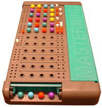

.. Master Mind documentation master file, created by
   sphinx-quickstart on Tue May 30 11:39:47 2017.
   You can adapt this file completely to your liking, but it should at least
   contain the root `toctree` directive.

Bienvenue dans la documentation du MasterMind !
***********************************************
Introduction:
=============
Le Mastermind ou Master Mind est un jeu de société pour deux joueurs dont le but est de trouver un code. C'est un jeu de réflexion, et de déduction, inventé par Mordecai Meirowitz dans les années 1970 alors qu'il travaillait comme expert en télécommunications. Au départ, il est édité par Capiépa1.

Le MasterMind
=============
.. toctree::
   :maxdepth: 2

   installation
   lancer
   regles	     
	      
